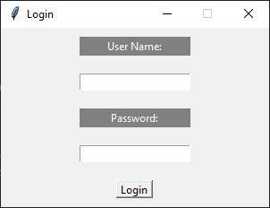
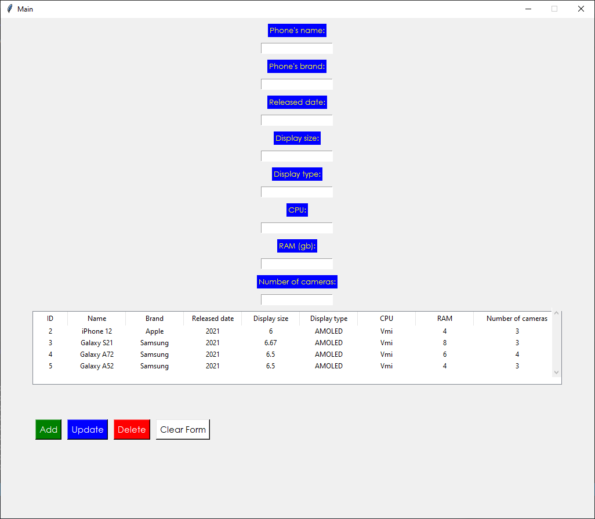

# SOE-ProgAlap2-Beadando-Raktarkezelo
Homor Bela

A program egy egyszerű CRUD (Create, Read, Update, Delete) műveletekkel bíró, SQL adatbázissal működő "raktárkezelő" program.

## A következő ablak fogad elinditáskor:

```
## 1. Belépés
Itt adott felhasználóval lehet belépni, a programban, jelenleg csak 1 felhasználó van eltárolva (admin:password).
```

## A következő ablak fogad bejelentkezés után:

```
## 2. Kezelés
Itt láthatóak, az adatbázisban eltárolt adatok. Ezeken a lent látható gombok segítségvel tudunk műveleteket végrehajtani. A program esetében az alap CRUD műveletek végezhetőek el.
```
## Fájlok
- database.db -> Itt vannak tárolva az adatok. SQLite3-mal lett létrehozva, és SQL parancsokkal kezelhető.
- Model.py -> A változók itt vannak deklarálva.
- View.py -> Ez felel a megjelenítésért.
- Controller.py -> Ez felelel, a háttérlogikai folyamatokért.
- create_db.py -> Ezzel hoztam létre a programhoz az adatbázist.